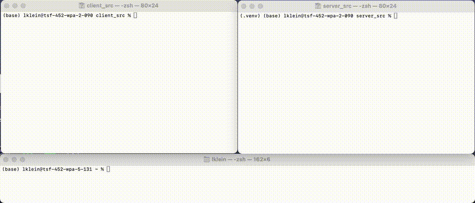

# Speech-to-Type Walkie Talkie

## Demo



**Notes on the Demo:**

*   The demo video does not include sound. To see when recording starts and stops, watch the top-left terminal for the log messages (e.g., "🎤 Started Listening...", "🛑 Stopped Listening..."). The recording phase takes the most time; the transcription itself is very fast.
*   The transcribed text is typed automatically using accessibility features based on where your **cursor focus** currently is. Avoid clicking the mouse or changing the active input field between stopping the recording and the text appearing, otherwise the text might be typed in the wrong place.

This project provides a system-wide "walkie-talkie" mode for speech-to-text input.

## How it Works

1.  Run the server.
2.  Run the client.
3.  Press `Ctrl + Shift + S` to start recording audio.
4.  Press `Ctrl + Shift + S` again to stop recording.
5.  The recorded audio is sent to the local server.
6.  The server transcribes the audio.
7.  The transcribed text is sent back to the client.
8.  The client automatically types the text into whichever input field currently has focus.

## Platform Compatibility

**Note:** This project has currently only been tested on **macOS**.

## Setup & Usage

### Server (Python)

1.  **Navigate to the server directory:**
    ```bash
    cd server_src
    ```
2.  **Set up a virtual environment (recommended):**
    ```bash
    pip install uv # Or use pip/conda
    uv venv .venv
    source .venv/bin/activate # On macOS/Linux
    # .venv\Scripts\activate   # On Windows
    ```
3.  **Install dependencies:**
    ```bash
    uv pip install -r requirements.txt
    ```
4.  **Run the server:**
    ```bash
    python main.py
    ```

### Client (Go)

1.  **Navigate to the client directory:**
    ```bash
    cd client_src
    ```
2.  **(First time only) Install Go dependencies:**
    ```bash
    go mod tidy
    ```
3.  **Run the client:**
    ```bash
    go run main.go
    ```

Now you can use `Ctrl + Shift + S` anywhere on your system to start/stop recording and have the transcribed text typed out.

## Customization

This project is designed to be hackable! If you want to change the key combination used to trigger recording, modify the `hook.Register` line in `client_src/main.go`.